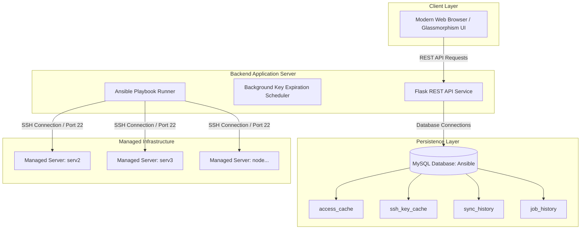

# 🔐 SSH Manager - Enterprise SSH Access & Key Control Center

An enterprise-grade, web-based SSH Key & Access Control Management System powered by **Flask**, **MySQL 8.0**, and **Ansible**. Designed to automate, audit, and secure SSH key infrastructure across multi-server environments.

---

## 🌟 Key Features

- 🔍 **Global Key Search & Inspector**: Instant, database-indexed search (<1ms) across all managed Linux servers by Username, Server Name, Fingerprint, Key Type (RSA, ED25519, ECDSA), Comment, Email, and Base64 Body.
- 🤝 **Cross-Server Key Sharing**: Safely copy SSH public keys between servers and Linux users with automatic duplicate detection (skips existing keys to prevent duplication).
- 🚀 **Centralized Key Deployment**: Add, Revoke, Purge, Disable, or Enable SSH access across target servers instantly.
- ⏳ **Time-Based Temporary Access**: Provision temporary SSH access with auto-expiration (30m, 1h, 12h, 5d, 15d, 30d). Expired keys are automatically revoked by the background scheduler.
- 📊 **Server-User Access Matrix**: Visual dashboard summarizing server access state and authorized key counts.
- 🔄 **Database-Driven Sync Engine**: Single source of truth powered by MySQL. Background sync engine scans servers via Ansible playbooks and reconciles local state.
- 📜 **Audit & Log Trail**: Complete execution history with real-time process output logs for compliance and security auditing.

---

## 🏗️ System Architecture



---

## 🗄️ MySQL Database Setup & Configuration

The application uses **MySQL** as its single source of truth for all SSH keys, user directories, and audit logs.

### Database Credentials

- **Host**: `127.0.0.1` (or `localhost`)
- **Port**: `3306`
- **Database Name**: `Ansible`
- **Username**: `ansible_user`
- **Password**: `Ansible@123`

### MySQL Setup Commands

If you need to set up the database from scratch, execute the following SQL commands in MySQL:

```sql
CREATE DATABASE Ansible DEFAULT CHARACTER SET utf8mb4 COLLATE utf8mb4_unicode_ci;

CREATE USER 'ansible_user'@'localhost' IDENTIFIED BY 'Ansible@123';
GRANT ALL PRIVILEGES ON Ansible.* TO 'ansible_user'@'localhost';

-- Optional: Allow connections from 127.0.0.1
CREATE USER 'ansible_user'@'127.0.0.1' IDENTIFIED BY 'Ansible@123';
GRANT ALL PRIVILEGES ON Ansible.* TO 'ansible_user'@'127.0.0.1';

FLUSH PRIVILEGES;
```

---

## 🔄 SQLite to MySQL Data Migration

If you have an existing SQLite `jobs.db` file, run the included migration script to copy all existing data into MySQL:

```bash
./venv/bin/python scripts/migrate_sqlite_to_mysql.py
```

Output:
```text
Starting migration from SQLite (jobs.db) -> MySQL (Ansible)...
Migrating records from access_cache...
Migrating records from ssh_key_cache...
Migrating records from sync_history...
Migrating records from job_history...
Migration from SQLite to MySQL completed successfully!
```

---

## 📖 Complete Workflow & Operations Guide

### 1. Global Search & Key Inspector
- Click **Global Search** in the sidebar.
- Type any search query (e.g. `mohit.tiwari@octrotalk.com`, `serv2`, `ssh-rsa`, or fingerprint).
- Results load instantly from MySQL B-Tree indexes.
- Click **Inspect Key** to view full key details, raw body, algorithm, and target Linux user home directory.

### 2. Key Sharing (Cross-Server Key Copy)
- Click **Key Sharing** in the sidebar.
- Step 1: Select **Source Server** and **Source User**.
- Step 2: Select one or more SSH keys from the source user.
- Step 3: Choose **Destination Server** and **Destination User**.
- Click **Validate & Preview**. The system checks MySQL to verify if the key already exists on the destination user.
- Click **Share Keys**. The keys are safely appended to the destination user's `authorized_keys` file via Ansible.

### 3. Key Deployment (Add / Revoke / Disable / Enable)
- Click **Key Deployment** in the sidebar.
- Select target servers, username, action type, and optional access duration.
- **Add Key**: Installs key with optional expiration.
- **Disable Access**: Temporarily disables SSH access by renaming `authorized_keys` to `.sshmanager_disabled` without deleting keys.
- **Enable Access**: Restores SSH access from `.sshmanager_disabled`.
- **Revoke / Purge**: Removes specified SSH keys or purges all access.

### 4. Background Synchronization Engine
- Click **Sync Now** in the top header or navigate to **Sync Engine**.
- The sync engine connects to managed servers via Ansible (`fetch_keys.yml`), discovers all Linux system users, parses `~/.ssh/authorized_keys`, and updates MySQL.
- Subsequent searches and matrix views use MySQL for instant sub-millisecond responses.

---

## 🚀 Getting Started & Running locally

### Prerequisites

- Python 3.10+
- MySQL 8.0 / MariaDB
- Ansible `ansible-core`
- SSH key access to target Linux servers configured in `inventory.ini`

### Quick Start

1. **Clone & Environment Setup**:
   ```bash
   cd /Users/mohittiwari/Ansible
   ```

2. **Configure Managed Servers**:
   Edit `inventory.ini` to declare target servers:
   ```ini
   [web_servers]
   serv2 ansible_host=172.0.16.85
   serv3 ansible_host=172.0.16.86
   ```

3. **Start Application**:
   Run the launcher script:
   ```bash
   ./run.sh
   ```
   Or launch directly via Python:
   ```bash
   ./venv/bin/python backend/app.py
   ```

4. **Access Web Interface**:
   Open browser at: [http://localhost:5050](http://localhost:5050)

---

## 📁 Repository Structure

```text
├── backend/
│   └── app.py                # Flask REST Backend API & MySQL Abstraction
├── frontend/
│   ├── index.html            # Single Page Dashboard Interface
│   ├── css/
│   │   └── style.css         # Glassmorphism UX Design System
│   └── js/
│       └── app.js            # Modular Frontend Logic & Event Controllers
├── scripts/
│   └── migrate_sqlite_to_mysql.py  # 1-Click Migration Script (SQLite -> MySQL)
├── inventory.ini             # Ansible Inventory Configuration
├── fetch_keys.yml            # Key Discovery Playbook
├── manage_keys.yml           # Key Deployment & Access Control Playbook
├── run.sh                    # Web Service Launcher Script
└── README.md                 # Project Architecture Documentation
```

---

## 🔒 Security Best Practices

- Store MySQL production passwords in environment variables (`MYSQL_PASSWORD`).
- Use dedicated SSH deployment keys for Ansible execution.
- Monitor `job_history` table for full audit compliance.
