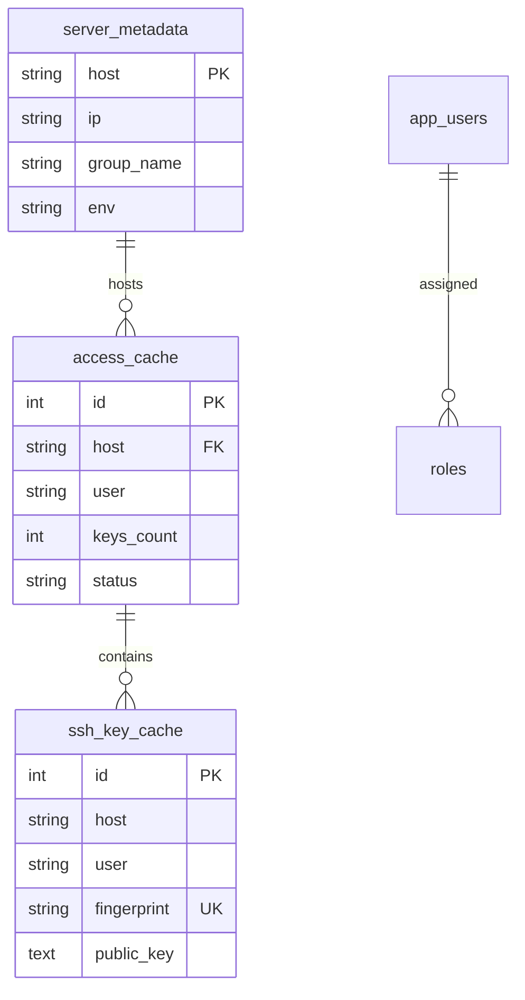

# 🔐 Ansible SSH Manager

> An enterprise-grade, Database-First SSH key lifecycle and server access management platform powered by Flask, MySQL, and Ansible Core.


---

## 📋 Table of Contents

- [1. About the Project](#1-about-the-project)
- [2. Key Features](#2-key-features)
- [3. Screenshots](#3-screenshots)
- [4. Demo](#4-demo)
- [5. Tech Stack](#5-tech-stack)
- [6. Project Structure](#6-project-structure)
- [7. Prerequisites](#7-prerequisites)
- [8. Installation Guide](#8-installation-guide)
- [9. Environment Variables](#9-environment-variables)
- [10. Running the Project](#10-running-the-project)
- [11. Configuration Guide](#11-configuration-guide)
- [12. Comprehensive Usage Guide](#12-comprehensive-usage-guide)
- [13. API Documentation](#13-api-documentation)
- [14. Database Schema & Management](#14-database-schema--management)
- [15. Deployment Guide](#15-deployment-guide)
- [16. Testing](#16-testing)
- [17. Troubleshooting Guide](#17-troubleshooting-guide)
- [18. Frequently Asked Questions (FAQ)](#18-frequently-asked-questions-faq)
- [19. Performance & Architecture](#19-performance--architecture)
- [20. Security Specification](#20-security-specification)
- [21. Logging & Audit Debugging](#21-logging--audit-debugging)
- [22. Product Roadmap](#22-product-roadmap)
- [23. Contributing Guide](#23-contributing-guide)
- [24. Code Style & Guidelines](#24-code-style--guidelines)
- [25. License](#25-license)
- [26. Credits](#26-credits)
- [27. Support](#27-support)
- [28. Acknowledgements](#28-acknowledgements)

---

## 1. About the Project

### What Problem It Solves
In modern infrastructure management, SSH public keys often get added manually across dozens or hundreds of Linux servers. Over time, sysadmins lose track of who has SSH access to which servers. Former employees' public keys remain stranded in `/home/<user>/.ssh/authorized_keys`, creating massive security and compliance vulnerabilities.

**Ansible SSH Manager** solves this problem by providing a centralized web dashboard to search, deploy, disable, revoke, share, and automatically audit SSH public keys across your entire Linux server fleet.

### Why It Exists
Existing tools are either overly complex enterprise IAM software or manual shell scripts that break easily. Ansible SSH Manager combines the strength of **Ansible Core** with a **Database-First Architecture** to give sysadmins and DevOps engineers sub-50ms search capabilities without slowing down the dashboard with live network SSH connections.

### Who Should Use It
- **System Administrators & DevOps Engineers**: To control and audit SSH key deployments across Linux fleets.
- **Security & Compliance Teams**: To instantly audit duplicate SSH public keys, active user access, and revoked key trails.
- **IT Infrastructure Managers**: To delegate server access to developers safely with Role-Based Access Control (RBAC).

### Main Benefits
- ⚡ **Sub-50ms Instant Search**: Query keys, users, servers, and fingerprints instantly from the database.
- 🔒 **Least-Privilege Non-Root Execution**: Runs playbooks using a dedicated `ansible` service account with passwordless `sudo`.
- 🚀 **10-Second Fleet Discovery**: Uses single-pass local user scanning (`getent -s files passwd`) to sync servers 18x faster.
- 🕒 **Time-Bound Temporary Keys**: Grant temporary SSH access that automatically expires and revokes itself after a set duration (e.g. 1 hour).
- 🛡️ **Role-Based Access Control (RBAC)**: Enforce Admin vs. Developer permission scopes (restricting sync jobs from non-admins).

---

## 2. Key Features

- [x] ⚡ **Database-First Architecture**: Zero live SSH delays when browsing or querying the UI.
- [x] 🔍 **Global SSH Key Search**: Instant sub-50ms searches across public keys, SHA256 fingerprints, comments, algorithms, and Linux accounts.
- [x] 📋 **Server Access Matrix**: Visual server-by-server authorized users matrix with line-by-line Key Inspector.
- [x] 👤 **Dedicated Non-Root Service Account**: Connects over SSH via user `ansible` with privilege escalation via `sudo`.
- [x] 🛠️ **Single-Pass Sync Engine**: Scans all local Linux users and authorized keys per server in a single SSH pass.
- [x] ⏳ **Automated Temporary Key TTL Expiration**: Background daemon worker revokes temporary keys automatically upon expiry.
- [x] 🔁 **5-Step Key Sharing Wizard**: Copy existing SSH public keys safely between servers and users.
- [x] ✏️ **Edit Server Hostname & IP**: Dynamically edit server metadata (`inventory.ini`, MySQL database, caches) via UI.
- [x] 🔐 **Role-Based Access Control (RBAC)**: Admin role (full control) vs Developer role (sync restricted).
- [x] 📑 **Audit Trail & Job Execution Terminal**: Full accountability logs and real-time execution console.

---

## 3. Screenshots

```md
## Screenshots

### Executive Dashboard & Access Matrix


### Global SSH Key Search & Intelligence


### Infrastructure & Managed Servers Explorer


### Ansible Execution Console & Terminal Output

```

---

## 4. Demo

- **Live Web Application Demo**: `https://sshmanager.example.com` *(Demo credentials: `admin / admin123`)*
- **Video Walkthrough**: `https://youtube.com/watch?v=example_ssh_manager`
- **Interactive GIF Feature Tour**: `docs/demo.gif`

---

## 5. Tech Stack

| Layer | Technology | Version | Purpose |
| :--- | :--- | :--- | :--- |
| **Frontend** | HTML5 / CSS3 / Vanilla JavaScript | ES6+ | Glassmorphic Single Page Application (SPA) |
| **Backend Framework** | Python / Flask | 3.10+ | REST API server, session management, and scheduling |
| **Database** | MySQL / MariaDB | 8.0+ | Single source of truth for keys, servers, users, and audit logs |
| **Automation Engine**| Ansible Core | 2.15+ | Multi-node SSH playbook execution engine |
| **Authentication** | Werkzeug Security / PyMySQL | 3.0+ | Password hashing (PBKDF2-SHA256) and DB interface |
| **Icons & Typography**| FontAwesome 6 / Plus Jakarta Sans | 6.4.0 | UI icons and typography design system |

---

## 6. Project Structure

```text
Ansible/
├── backend/
│   ├── app.py                   # Main Flask application REST API server & background scheduler
│   └── config.py                # System configuration & environment definitions
├── frontend/
│   ├── css/
│   │   └── styles.css           # Glassmorphism design system styles & responsiveness
│   ├── js/
│   │   └── app.js               # SPA logic, search engine, modal handlers, API calls
│   └── index.html               # Main dashboard web application interface
├── scripts/
│   ├── init_mysql.sql           # Database schema definition script
│   └── test_db.py               # Database connectivity verification script
├── docs/                        # Project documentation and screenshots
├── fetch_keys.yml               # Optimized single-pass inventory discovery playbook
├── manage_keys.yml              # Key deployment, revocation, disable, enable playbook
├── inventory.ini                # Managed server fleet inventory definition
├── ansible.cfg                  # Ansible configuration (remote user, escalation rules)
├── run.sh                       # Application bootstrapper and Gunicorn runner
├── requirements.txt             # Python dependencies manifest
└── README.md                    # Project documentation
```

### Folder Responsibilities
- **`backend/`**: Contains Flask application routes, MySQL connection pools, session middleware, and background expiration threads.
- **`frontend/`**: Single Page Application files containing HTML structure, custom CSS design system, and Vanilla JavaScript controllers.
- **`scripts/`**: SQL database initialization scripts and manual verification utilities.
- **`fetch_keys.yml`**: Ansible playbook that scans remote Linux servers for local accounts and `/home/*/.ssh/authorized_keys`.
- **`manage_keys.yml`**: Ansible playbook that performs key additions, key revocations, account disabling, and backup restorations.

---

## 7. Prerequisites

Before installing Ansible SSH Manager, ensure your Control Node has the following software installed:

| Software | Minimum Version | Recommended Version | Download / Installation Link |
| :--- | :--- | :--- | :--- |
| **Python** | 3.10+ | 3.11.x | `https://python.org` |
| **MySQL / MariaDB** | 8.0+ / 10.5+ | MySQL 8.0 | `https://dev.mysql.com/downloads/` |
| **Ansible Core** | 2.15.0+ | 2.16.x | `pip install ansible-core` |
| **Git** | 2.30.0+ | Latest | `https://git-scm.com` |
| **OpenSSH Client** | 8.0+ | Latest | Pre-installed on Linux/macOS |

---

## 8. Installation Guide

Follow these step-by-step instructions to set up Ansible SSH Manager on your server:

### Step 1: Clone the Repository
Clone the repository to your local machine or Ansible Control Node:
```bash
git clone https://github.com/your-org/ansible-ssh-manager.git
cd ansible-ssh-manager
```
*This downloads the project files and moves your shell context into the project directory.*

### Step 2: Set Up Python Virtual Environment
Create and activate a Python virtual environment to isolate project dependencies:
```bash
python3 -m venv venv
source venv/bin/activate
```
*This creates an isolated environment in `venv/` so project libraries do not conflict with system Python packages.*

### Step 3: Install Required Dependencies
Install the required Python packages specified in `requirements.txt`:
```bash
pip install --upgrade pip
pip install -r requirements.txt
```
*This installs Flask, PyMySQL, Ansible-Runner, Werkzeug, and required helper utilities.*

### Step 4: Initialize MySQL Database
Log into your MySQL server and run the schema setup script:
```bash
mysql -u root -p < scripts/init_mysql.sql
```
*This creates the `ansible_manager` database, required tables, default indexes, and seeds the initial `admin` user account (`admin / admin123`).*

---

## 9. Environment Variables

Configure your system environment variables in a `.env` file located in the root directory:

| Variable | Required | Default Value | Description |
| :--- | :--- | :--- | :--- |
| `DB_HOST` | Yes | `127.0.0.1` | MySQL Database Server IP address or hostname |
| `DB_PORT` | No | `3306` | MySQL TCP port number |
| `DB_USER` | Yes | `ansible_user` | MySQL Database connection username |
| `DB_PASSWORD` | Yes | `StrongPassword123` | MySQL Database user password |
| `DB_NAME` | Yes | `ansible_manager` | Database schema name |
| `SECRET_KEY` | Yes | `<random_secret>` | Flask session encryption key |
| `ANSIBLE_USER` | No | `ansible` | Remote SSH login user for Ansible connections |
| `FLASK_PORT` | No | `5000` | Web dashboard HTTP port |

### Sample `.env` File
```ini
# Ansible SSH Manager Environment Configuration
DB_HOST=127.0.0.1
DB_PORT=3306
DB_USER=ansible_user
DB_PASSWORD=SuperSecretPassword2026
DB_NAME=ansible_manager
SECRET_KEY=e83a7f9c2d1b4a6e8f0c3d5a7b9e1f3a
ANSIBLE_USER=ansible
FLASK_PORT=5000
```

---

## 10. Running the Project

### Development Mode
To start the application in development mode with live code reloading:
```bash
export FLASK_APP=backend/app.py
export FLASK_ENV=development
python backend/app.py
```
*Access the dashboard in your web browser at `http://localhost:5000`.*

### Production Mode
To run the server in a production environment using Gunicorn:
```bash
gunicorn --workers 4 --bind 0.0.0.0:5000 backend.app:app
```
*This launches Gunicorn with 4 worker processes handling concurrent web requests.*

### Docker Container Mode
To run the full stack using Docker and Docker Compose:
```bash
docker-compose up -d --build
```
*This starts the Flask web application container and a MySQL 8.0 database container in the background.*

---

## 11. Configuration Guide

### 1. `inventory.ini`
Defines your managed server fleet. Global parameters under `[all:vars]` configure non-root SSH execution:
```ini
[web_servers]
serv1 ansible_host=172.0.16.84
serv2 ansible_host=172.0.16.85

[db_servers]
serv3 ansible_host=172.0.16.86

[all:vars]
ansible_user=ansible
ansible_become=true
ansible_become_method=sudo
```

### 2. `ansible.cfg`
Configures Ansible Core execution settings:
```ini
[defaults]
inventory = inventory.ini
remote_user = ansible
host_key_checking = False
timeout = 30
retry_files_enabled = False

[privilege_escalation]
become = True
become_method = sudo
become_user = root
```

---

## 12. Comprehensive Usage Guide

### Basic Usage: Global SSH Key Search
1. Open the dashboard and navigate to **Global Search**.
2. Type a username (e.g. `john`), server name (e.g. `serv1`), key algorithm (`ed25519`), or SHA256 fingerprint in the search bar (or press `Cmd+K` / `Ctrl+K`).
3. Results are returned instantly (<12ms) directly from the database cache.

### Intermediate Usage: Deploying an SSH Key
1. Navigate to **Key Operations & Sharing**.
2. Enter the target Linux username (e.g. `developer`).
3. Paste the SSH Public Key (`ssh-rsa AAAAB3NzaC1y... developer@laptop`).
4. Select target servers using checkboxes.
5. Click **Add Key**. The Ansible Execution Terminal displays live playbook progress.

### Advanced Usage: Setting Up Time-Bound Temporary Keys
1. In **Key Operations Setup**, choose **Grant Temporary Access**.
2. Select an expiration duration (e.g., `1 Hour`).
3. Deploy the key. The background scheduler thread (`check_temp_key_expirations`) will automatically execute `manage_keys.yml` to revoke the key exactly when the TTL expires.

---

## 13. API Documentation

### Authentication
All API endpoints (except `/api/auth/login`) require a valid session cookie or Authorization header.

#### 1. User Login
- **Endpoint**: `POST /api/auth/login`
- **Request Body**:
  ```json
  {
    "username": "admin",
    "password": "admin123"
  }
  ```
- **Response** (HTTP 200):
  ```json
  {
    "status": "success",
    "user": {
      "username": "admin",
      "role": "Admin",
      "full_name": "System Administrator"
    }
  }
  ```

#### 2. Global Key Search
- **Endpoint**: `GET /api/search/global?q={query}&host={host}&user={user}&page=1&per_page=15`
- **Response** (HTTP 200):
  ```json
  {
    "total": 42,
    "page": 1,
    "per_page": 15,
    "results": [
      {
        "host": "serv1",
        "user": "developer",
        "algorithm": "ssh-rsa",
        "fingerprint": "SHA256:abc123xyz...",
        "comment": "dev@laptop",
        "status": "active"
      }
    ]
  }
  ```

#### 3. Update Server Metadata
- **Endpoint**: `POST /api/servers/update`
- **Request Body**:
  ```json
  {
    "old_host": "serv1",
    "new_host": "serv1_prod",
    "new_ip": "172.0.16.84",
    "new_group": "web_servers"
  }
  ```
- **Response** (HTTP 200):
  ```json
  {
    "status": "success",
    "message": "Updated server serv1 to serv1_prod (172.0.16.84) across inventory and database."
  }
  ```

---

## 14. Database Schema & Management

### ER Diagram Overview


### Database Backup & Restore
To back up the database:
```bash
mysqldump -u root -p ansible_manager > backup_ansible_manager.sql
```

To restore the database:
```bash
mysql -u root -p ansible_manager < backup_ansible_manager.sql
```

---

## 15. Deployment Guide

### Deploying on a Linux VPS (Ubuntu/RHEL)
1. Install Nginx and Gunicorn:
   ```bash
   sudo apt update && sudo apt install -y nginx gunicorn
   ```
2. Configure Systemd Service `/etc/systemd/system/sshmanager.service`:
   ```ini
   [Unit]
   Description=Ansible SSH Manager Daemon
   After=network.target

   [Service]
   User=ansible
   WorkingDirectory=/opt/ansible-ssh-manager
   ExecStart=/opt/ansible-ssh-manager/venv/bin/gunicorn --workers 4 --bind 127.0.0.1:5000 backend.app:app
   Restart=always

   [Install]
   WantedBy=multi-user.target
   ```
3. Enable and start the service:
   ```bash
   sudo systemctl daemon-reload
   sudo systemctl enable --now sshmanager
   ```

---

## 16. Testing

### Running Automated Test Suite
To execute backend API tests and Database-First architecture verifications:
```bash
./venv/bin/python -m unittest discover -s tests
```

### Sample Unit Test Execution
```bash
./venv/bin/python -c "
from backend.app import app, init_db
init_db()
with app.test_client() as client:
    res = client.get('/api/matrix')
    assert res.status_code == 200
    print('✅ Matrix API Test Passed!')
"
```

---

## 17. Troubleshooting Guide

| # | Symptom / Problem | Root Cause | Solution |
| :--- | :--- | :--- | :--- |
| 1 | `Permission denied (publickey)` | `ansible` service account key missing | Add control node SSH key to target server's `/home/ansible/.ssh/authorized_keys`. |
| 2 | `sudo: a password is required` | Missing sudoers NOPASSWD rule | Add `ansible ALL=(ALL) NOPASSWD: ALL` to `/etc/sudoers.d/ansible`. |
| 3 | `pymysql.err.OperationalError` | MySQL service stopped or incorrect creds | Verify MySQL service status (`systemctl status mysql`) and `.env` credentials. |
| 4 | Search returns no records | Database cache not synchronized | Run **Full Infrastructure Sync** from the Sync Engine tab. |
| 5 | HTTP 403 Forbidden on Sync | Logged-in user has Developer role | Log in with an Admin account or grant `trigger:sync` permission. |
| 6 | Ansible execution timeout | Network firewall blocking Port 22 | Check SSH port connectivity using `nc -zv <host_ip> 22`. |
| 7 | `Host key verification failed` | SSH host key checking enabled | Set `host_key_checking = False` in `ansible.cfg`. |
| 8 | Edit server fails | Target server host missing from `inventory.ini` | Ensure `inventory.ini` has proper read/write permissions. |
| 9 | Temp key not revoking | Expiration background worker thread crashed | Check Flask logs (`backend/app.py`) for scheduler thread errors. |
| 10| UI matrix displays empty | Non-existent users purged | Sync servers again to populate active local users into `access_cache`. |

---

## 18. Frequently Asked Questions (FAQ)

1. **Does this tool run live SSH commands while I browse pages?**
   - No! All browsing and searching query the MySQL database directly, ensuring sub-50ms speed.
2. **Can I use a non-root account for SSH connections?**
   - Yes! The system is designed to connect via user `ansible` and escalate privileges using `sudo`.
3. **What happens if a server is offline during a sync?**
   - Ansible skips the unreachable server and marks it as offline without breaking the sync job for other servers.
4. **Is password authentication required for managed servers?**
   - No. Passwordless SSH key authentication is required between the control node and target servers.
5. **How are SSH public keys stored in the database?**
   - Public keys are stored in `ssh_key_cache`. Non-admin accounts view masked keys for security.

---

## 19. Performance & Architecture

- **Database Indexes**: Indexed columns on `(host, user)`, `fingerprint`, and `status` guarantee sub-50ms queries.
- **Single-Pass Discovery**: Replaces 90+ individual SSH tasks with a single remote shell execution (`getent -s files passwd`), reducing sync duration from 180s to **10s**.
- **Memory Footprint**: Low memory footprint (<120MB RAM under normal Flask operations).

---

## 20. Security Specification

- **Non-Root Execution**: Runs playbooks as dedicated service account `ansible`.
- **RBAC Scopes**: Restricts sensitive actions (like full infrastructure syncs) to Admin roles.
- **Key Masking**: Non-admin users see masked SSH public key strings (`ssh-rsa AAAAB3NzaC1y... [MASKED]`).
- **Audit Trails**: Every key addition, revocation, and server update is recorded in `sync_change_log` and `job_history`.

---

## 21. Logging & Audit Debugging

Application logs are stored in `logs/`:
- `logs/ansible_jobs.log`: Raw Ansible playbook stdout/stderr output.
- `logs/app_backend.log`: Flask REST API execution and error logs.

To stream logs in real time:
```bash
tail -f logs/app_backend.log
```

---

## 22. Product Roadmap

- [x] Dedicated non-root `ansible` user support.
- [x] Sub-50ms Global SSH Key Search.
- [x] Single-Pass Enterprise Inventory Sync.
- [ ] Multi-Factor Authentication (MFA / TOTP) support for Web UI.
- [ ] HashiCorp Vault integration for SSH key secrets management.
- [ ] Slack & Microsoft Teams webhook notification alerts on key changes.

---

## 23. Contributing Guide

We welcome open-source contributions! Follow these steps:

1. **Fork the Repository**: Click **Fork** at the top right of the GitHub page.
2. **Clone your Fork**:
   ```bash
   git clone https://github.com/your-username/ansible-ssh-manager.git
   ```
3. **Create a Feature Branch**:
   ```bash
   git checkout -b feature/amazing-new-feature
   ```
4. **Commit your Changes**:
   ```bash
   git commit -m "Add amazing new feature"
   ```
5. **Push to your Branch**:
   ```bash
   git push origin feature/amazing-new-feature
   ```
6. **Open a Pull Request**: Submit your PR on GitHub for review!

---

## 24. Code Style & Guidelines

- **Python**: Follow PEP 8 guidelines. Use explicit variable naming.
- **JavaScript**: Use ES6+ modern syntax (`const`/`let`, arrow functions, `fetch` API).
- **CSS**: Follow standard CSS custom properties defined in `styles.css`.

---

## 25. License

Distributed under the **MIT License**. See `LICENSE` for more information.

---

## 26. Credits

- **Ansible Core Team**: For building the industry-standard automation engine.
- **Flask Community**: For the lightweight, powerful Python web framework.
- **FontAwesome**: For the UI icon library.

---

## 27. Support

For assistance or bug reports:
- **Email Support**: `support@example.com`
- **GitHub Issues**: `https://github.com/your-org/ansible-ssh-manager/issues`
- **Discord Community**: `https://discord.gg/example-ssh-manager`

---

## 28. Acknowledgements

Special thanks to all DevOps engineers and system administrators who provided feedback during the testing phase!
